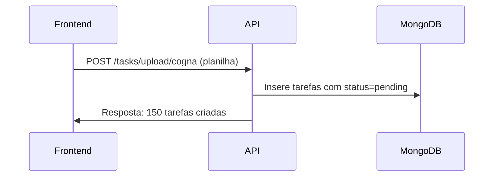
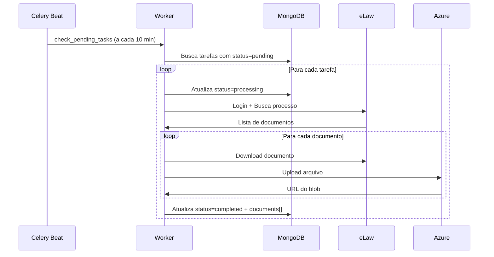
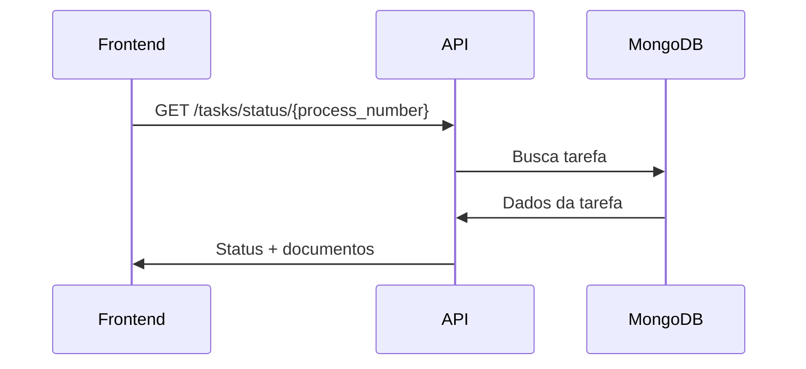

# 📘 Documentação de Integração - RPA FluxLaw API

## 📋 Índice
1. [Visão Geral](#visão-geral)
2. [Arquitetura do Sistema](#arquitetura-do-sistema)
3. [Instalação e Configuração](#instalação-e-configuração)
4. [Endpoints da API](#endpoints-da-api)
5. [Exemplos de Integração](#exemplos-de-integração)
6. [Estrutura de Dados](#estrutura-de-dados)
7. [Fluxo de Processamento](#fluxo-de-processamento)
8. [Troubleshooting](#troubleshooting)
9. [Boas Práticas](#boas-práticas)

---

## 🎯 Visão Geral

O **RPA FluxLaw** é um sistema de automação robótica de processos (RPA) que realiza o download automatizado de documentos jurídicos do sistema eLaw COGNA. O sistema é composto por:

- **API REST (FastAPI)**: Interface para criar e gerenciar tarefas
- **Worker (Celery)**: Processamento assíncrono de tarefas RPA
- **MongoDB**: Armazenamento de tarefas e metadados
- **Azure Blob Storage**: Armazenamento de arquivos baixados
- **Redis**: Message broker para o Celery

### Características Principais

- ✅ Upload em lote via planilha Excel/CSV
- ✅ Processamento assíncrono e escalável
- ✅ Download de TODOS os documentos de cada processo
- ✅ Renomeação automática com padrão: `{processo}_{tipo}_{linha}.{ext}`
- ✅ Upload automático para Azure Blob Storage
- ✅ Metadados completos de cada documento
- ✅ Retry automático em caso de falha (3 tentativas)
- ✅ Monitoramento em tempo real via API

---

## 🏗️ Arquitetura do Sistema

```
┌─────────────┐      ┌─────────────┐      ┌─────────────┐
│   Frontend  │─────▶│  API REST   │─────▶│   MongoDB   │
│  (Seu App)  │      │  (FastAPI)  │      │  (Tarefas)  │
└─────────────┘      └─────────────┘      └─────────────┘
                            │
                            │ Cria tarefa
                            ▼
                     ┌─────────────┐
                     │    Redis    │
                     │  (Broker)   │
                     └─────────────┘
                            │
                            │ Consome tarefa
                            ▼
                     ┌─────────────┐      ┌─────────────┐
                     │   Worker    │─────▶│    eLaw     │
                     │  (Celery)   │      │   (COGNA)   │
                     └─────────────┘      └─────────────┘
                            │
                            │ Upload
                            ▼
                     ┌─────────────┐
                     │   Azure     │
                     │    Blob     │
                     └─────────────┘
```

---

## 🔧 Instalação e Configuração

### Pré-requisitos

- Python 3.9+
- MongoDB
- Redis
- Azure Storage Account (opcional)
- Chrome/ChromeDriver

### 1. Instalação de Dependências

```bash
# Clone o repositório
git clone <repo-url>
cd rpa-fluxlaw

# Crie um ambiente virtual
python -m venv venv
source venv/bin/activate  # Linux/Mac
# ou
venv\Scripts\activate  # Windows

# Instale as dependências
pip install -r requirements.txt
```

### 2. Configuração de Variáveis de Ambiente

Crie um arquivo `.env` na raiz do projeto:

```env
# MongoDB
MONGODB_URI=mongodb://localhost:27017/
MONGODB_DB_NAME=rpa_fluxlaw

# Celery / Redis
CELERY_BROKER_URL=redis://localhost:6379/0
CELERY_RESULT_BACKEND=redis://localhost:6379/0

# Azure Blob Storage
AZURE_STORAGE_CONNECTION_STRING=DefaultEndpointsProtocol=https;AccountName=...
AZURE_STORAGE_CONTAINER_NAME=rpa-documents

# eLaw Credentials
ELAW_USERNAME=seu_usuario
ELAW_PASSWORD=sua_senha

# API Settings
API_TITLE=RPA FluxLaw API
API_VERSION=1.0.0
API_DESCRIPTION=API para orquestração de tarefas RPA
```

### 3. Iniciar os Serviços

**Terminal 1 - MongoDB:**
```bash
mongod
```

**Terminal 2 - Redis:**
```bash
redis-server
```

**Terminal 3 - API FastAPI:**
```bash
python main.py
# ou
uvicorn main:app --host 0.0.0.0 --port 8000 --reload
```

**Terminal 4 - Celery Worker:**
```bash
celery -A worker worker --loglevel=info
```

**Terminal 5 - Celery Beat (Agendador):**
```bash
celery -A worker beat --loglevel=info
```

### 4. Verificar Instalação

Acesse a documentação interativa da API:
```
http://localhost:8000/docs
```

---

## 🚀 Endpoints da API

### Base URL
```
http://localhost:8000
```

### 1. Health Check

**GET** `/health`

Verifica se a API e o MongoDB estão funcionando.

**Resposta:**
```json
{
  "status": "healthy",
  "mongodb": "connected"
}
```

---

### 2. Upload de Planilha

**POST** `/tasks/upload/{client_name}`

Cria tarefas em lote a partir de uma planilha Excel ou CSV.

**Parâmetros:**
- `client_name` (path): Nome do cliente/robô (ex: "cogna")
- `file` (form-data): Arquivo Excel (.xlsx, .xls) ou CSV

**Formato da Planilha:**

A planilha deve conter uma coluna chamada `process_number`:

| process_number          |
|------------------------|
| 0569584-89.2017.8.05.0001 |
| 1234567-12.2020.8.05.0001 |
| ...                     |

**Exemplo com cURL:**
```bash
curl -X POST \
  "http://localhost:8000/tasks/upload/cogna" \
  -H "Content-Type: multipart/form-data" \
  -F "file=@processos.xlsx"
```

**Exemplo com Python:**
```python
import requests

url = "http://localhost:8000/tasks/upload/cogna"
files = {"file": open("processos.xlsx", "rb")}
response = requests.post(url, files=files)
print(response.json())
```

**Exemplo com JavaScript/Fetch:**
```javascript
const formData = new FormData();
formData.append('file', fileInput.files[0]);

fetch('http://localhost:8000/tasks/upload/cogna', {
  method: 'POST',
  body: formData
})
.then(response => response.json())
.then(data => console.log(data));
```

**Resposta:**
```json
{
  "message": "Tarefas criadas com sucesso",
  "tasks_created": 150,
  "client_name": "cogna"
}
```

---

### 3. Buscar Tarefa por ID

**GET** `/tasks/{task_id}`

Retorna detalhes completos de uma tarefa, incluindo todos os documentos baixados.

**Parâmetros:**
- `task_id` (path): ID da tarefa (ObjectId do MongoDB)

**Exemplo:**
```bash
curl -X GET "http://localhost:8000/tasks/507f1f77bcf86cd799439011"
```

**Resposta:**
```json
{
  "id": "507f1f77bcf86cd799439011",
  "process_number": "0569584-89.2017.8.05.0001",
  "client_name": "cogna",
  "status": "completed",
  "file_path": "https://mystorageaccount.blob.core.windows.net/rpa-documents/cogna/0569584-89.2017.8.05.0001/056958489201780050001_documentos_01.pdf",
  "total_documents": 9,
  "documents": [
    {
      "numero_linha": 1,
      "nome_arquivo_original": "COGNA - Check list ALINE CRISTINE GONCALVES SOUZA.pdf",
      "tipo_documento": "documentos",
      "nome_arquivo_final": "056958489201780050001_documentos_01.pdf",
      "blob_url": "https://mystorageaccount.blob.core.windows.net/rpa-documents/cogna/0569584-89.2017.8.05.0001/056958489201780050001_documentos_01.pdf"
    },
    {
      "numero_linha": 2,
      "nome_arquivo_original": "0569584-89.2017.8.05.0001-1723572343570-10817-decisao.pdf",
      "tipo_documento": "decisao_intimacao_de_pagamento",
      "nome_arquivo_final": "056958489201780050001_decisao_intimacao_de_pagamento_02.pdf",
      "blob_url": "https://mystorageaccount.blob.core.windows.net/rpa-documents/cogna/0569584-89.2017.8.05.0001/056958489201780050001_decisao_intimacao_de_pagamento_02.pdf"
    },
    {
      "numero_linha": 3,
      "nome_arquivo_original": "0569584-89.2017.8.05.0001-sentenca.pdf",
      "tipo_documento": "sentenca",
      "nome_arquivo_final": "056958489201780050001_sentenca_03.pdf",
      "blob_url": "https://mystorageaccount.blob.core.windows.net/rpa-documents/cogna/0569584-89.2017.8.05.0001/056958489201780050001_sentenca_03.pdf"
    }
  ],
  "created_at": "2025-01-06T10:00:00",
  "updated_at": "2025-01-06T10:05:30"
}
```

---

### 4. Buscar Status por Número do Processo

**GET** `/tasks/status/{process_number}`

Busca o status de uma tarefa pelo número do processo.

**Parâmetros:**
- `process_number` (path): Número do processo

**Exemplo:**
```bash
curl -X GET "http://localhost:8000/tasks/status/0569584-89.2017.8.05.0001"
```

**Resposta:**
```json
{
  "process_number": "0569584-89.2017.8.05.0001",
  "status": "completed",
  "file_path": "https://mystorageaccount.blob.core.windows.net/...",
  "total_documents": 9,
  "documents": [ /* array completo */ ],
  "updated_at": "2025-01-06T10:05:30"
}
```

---

### 5. Listar Tarefas

**GET** `/tasks/`

Lista tarefas com filtros opcionais.

**Query Parameters:**
- `status_filter` (optional): Filtrar por status (`pending`, `processing`, `completed`, `failed`)
- `limit` (optional): Número máximo de tarefas (default: 100)

**Exemplos:**
```bash
# Listar todas as tarefas
curl -X GET "http://localhost:8000/tasks/"

# Listar apenas tarefas pendentes
curl -X GET "http://localhost:8000/tasks/?status_filter=pending"

# Listar primeiras 50 tarefas concluídas
curl -X GET "http://localhost:8000/tasks/?status_filter=completed&limit=50"
```

**Resposta:**
```json
{
  "count": 150,
  "tasks": [
    {
      "id": "507f1f77bcf86cd799439011",
      "process_number": "0569584-89.2017.8.05.0001",
      "client_name": "cogna",
      "status": "completed",
      "file_path": "https://...",
      "total_documents": 9,
      "documents": [ /* ... */ ],
      "created_at": "2025-01-06T10:00:00",
      "updated_at": "2025-01-06T10:05:30"
    },
    // ...
  ]
}
```

---

### 6. Disparar Processamento Manual

**POST** `/tasks/process-pending`

Força o processamento imediato de todas as tarefas pendentes (útil para testes).

**Exemplo:**
```bash
curl -X POST "http://localhost:8000/tasks/process-pending"
```

**Resposta:**
```json
{
  "message": "Processamento de tarefas pendentes disparado",
  "task_id": "a8f7b4c3-1234-5678-90ab-cdef12345678",
  "info": "As tarefas serão processadas pelo worker em alguns segundos"
}
```

---

## 📊 Estrutura de Dados

### Status da Tarefa

| Status | Descrição |
|--------|-----------|
| `pending` | Tarefa criada, aguardando processamento |
| `processing` | Tarefa em processamento pelo worker |
| `completed` | Tarefa concluída com sucesso |
| `failed` | Tarefa falhou após 3 tentativas |

### Modelo de Documento

Cada documento baixado possui os seguintes campos:

```typescript
interface DocumentInfo {
  numero_linha: number;           // Número da linha na tabela (1-indexed)
  nome_arquivo_original: string;  // Nome original do arquivo no eLaw
  tipo_documento: string;         // Tipo extraído da coluna "Tipo de Documento"
  nome_arquivo_final: string;     // Nome final após renomeação
  blob_url: string;              // URL completa do arquivo no Azure
}
```

### Modelo de Tarefa

```typescript
interface Task {
  id: string;                    // ID único da tarefa (MongoDB ObjectId)
  process_number: string;        // Número do processo
  client_name: string;           // Nome do cliente/robô
  status: TaskStatus;            // Status atual
  file_path?: string;           // URL do primeiro documento (compatibilidade)
  total_documents?: number;      // Total de documentos baixados
  documents?: DocumentInfo[];    // Array com todos os documentos
  created_at: string;           // Data/hora de criação (ISO 8601)
  updated_at: string;           // Data/hora da última atualização (ISO 8601)
}
```

---

## 🔄 Fluxo de Processamento

### 1. Criação de Tarefas



### 2. Processamento Automático



### 3. Consulta de Status



---

## 💡 Exemplos de Integração

### Exemplo 1: Frontend React

```javascript
import React, { useState, useEffect } from 'react';
import axios from 'axios';

const API_BASE_URL = 'http://localhost:8000';

function ProcessMonitor({ processNumber }) {
  const [task, setTask] = useState(null);
  const [loading, setLoading] = useState(true);

  useEffect(() => {
    const fetchTaskStatus = async () => {
      try {
        const response = await axios.get(
          `${API_BASE_URL}/tasks/status/${processNumber}`
        );
        setTask(response.data);
      } catch (error) {
        console.error('Erro ao buscar status:', error);
      } finally {
        setLoading(false);
      }
    };

    fetchTaskStatus();
    // Atualiza a cada 10 segundos
    const interval = setInterval(fetchTaskStatus, 10000);
    return () => clearInterval(interval);
  }, [processNumber]);

  if (loading) return <div>Carregando...</div>;

  return (
    <div>
      <h2>Processo: {task.process_number}</h2>
      <p>Status: <strong>{task.status}</strong></p>
      <p>Documentos: {task.total_documents || 0}</p>

      {task.status === 'completed' && task.documents && (
        <div>
          <h3>Documentos Baixados:</h3>
          <ul>
            {task.documents.map((doc, idx) => (
              <li key={idx}>
                <a href={doc.blob_url} target="_blank" rel="noopener noreferrer">
                  {doc.tipo_documento} - {doc.nome_arquivo_final}
                </a>
              </li>
            ))}
          </ul>
        </div>
      )}
    </div>
  );
}

export default ProcessMonitor;
```

### Exemplo 2: Python Backend

```python
import requests
import time

API_BASE_URL = "http://localhost:8000"

def upload_processes(file_path: str, client_name: str):
    """Upload de planilha com processos"""
    url = f"{API_BASE_URL}/tasks/upload/{client_name}"

    with open(file_path, 'rb') as f:
        files = {'file': f}
        response = requests.post(url, files=files)

    return response.json()

def monitor_task(process_number: str, max_attempts: int = 60):
    """Monitora uma tarefa até conclusão ou timeout"""
    url = f"{API_BASE_URL}/tasks/status/{process_number}"

    for attempt in range(max_attempts):
        response = requests.get(url)

        if response.status_code == 404:
            print(f"Tarefa não encontrada: {process_number}")
            return None

        task = response.json()
        status = task['status']

        print(f"[{attempt+1}/{max_attempts}] Status: {status}")

        if status == 'completed':
            print(f"✅ Processo concluído!")
            print(f"📁 {task['total_documents']} documento(s) baixado(s)")
            return task
        elif status == 'failed':
            print(f"❌ Processo falhou!")
            return task

        time.sleep(10)  # Aguarda 10 segundos

    print("⏰ Timeout ao aguardar conclusão")
    return None

# Exemplo de uso
if __name__ == "__main__":
    # 1. Upload de processos
    result = upload_processes("processos.xlsx", "cogna")
    print(f"✅ {result['tasks_created']} tarefas criadas")

    # 2. Monitora um processo específico
    task = monitor_task("0569584-89.2017.8.05.0001")

    if task and task['status'] == 'completed':
        for doc in task['documents']:
            print(f"📄 {doc['tipo_documento']}: {doc['blob_url']}")
```

### Exemplo 3: Node.js/Express

```javascript
const axios = require('axios');
const FormData = require('form-data');
const fs = require('fs');

const API_BASE_URL = 'http://localhost:8000';

// Upload de planilha
async function uploadProcesses(filePath, clientName) {
  const formData = new FormData();
  formData.append('file', fs.createReadStream(filePath));

  const response = await axios.post(
    `${API_BASE_URL}/tasks/upload/${clientName}`,
    formData,
    { headers: formData.getHeaders() }
  );

  return response.data;
}

// Buscar tarefa
async function getTask(taskId) {
  const response = await axios.get(`${API_BASE_URL}/tasks/${taskId}`);
  return response.data;
}

// Listar tarefas pendentes
async function getPendingTasks() {
  const response = await axios.get(`${API_BASE_URL}/tasks/`, {
    params: { status_filter: 'pending', limit: 100 }
  });
  return response.data;
}

// Exemplo de uso
(async () => {
  try {
    // Upload
    const result = await uploadProcesses('processos.xlsx', 'cogna');
    console.log(`✅ ${result.tasks_created} tarefas criadas`);

    // Listar pendentes
    const pending = await getPendingTasks();
    console.log(`📋 ${pending.count} tarefas pendentes`);
  } catch (error) {
    console.error('Erro:', error.message);
  }
})();
```

---

## 🐛 Troubleshooting

### Problema: API não inicia

**Erro:** `MongoClient connection error`

**Solução:**
1. Verifique se o MongoDB está rodando: `mongod`
2. Verifique a string de conexão no `.env`
3. Teste a conexão: `mongo mongodb://localhost:27017/`

---

### Problema: Worker não processa tarefas

**Sintomas:** Tarefas ficam em `pending` indefinidamente

**Solução:**
1. Verifique se o Redis está rodando: `redis-cli ping`
2. Verifique se o Worker está ativo: `celery -A worker worker`
3. Verifique os logs do worker para erros
4. Force o processamento: `POST /tasks/process-pending`

---

### Problema: Upload para Azure falha

**Erro:** `Azure Blob Storage connection failed`

**Solução:**
1. Verifique a connection string no `.env`
2. Teste a conexão com Azure Storage Explorer
3. Verifique permissões no container

---

### Problema: Login no eLaw falha

**Erro:** `AuthenticationException: Falha no login`

**Solução:**
1. Verifique credenciais no `.env`
2. Verifique se o Chrome/ChromeDriver está instalado
3. Teste o login manualmente no navegador

---

## ✅ Boas Práticas

### 1. Monitoramento

```python
# Implemente polling para monitorar tarefas
async def monitor_tasks_dashboard():
    while True:
        pending = await get_tasks_by_status('pending')
        processing = await get_tasks_by_status('processing')
        completed = await get_tasks_by_status('completed')
        failed = await get_tasks_by_status('failed')

        # Atualiza dashboard
        update_metrics({
            'pending': len(pending),
            'processing': len(processing),
            'completed': len(completed),
            'failed': len(failed)
        })

        await asyncio.sleep(30)  # Atualiza a cada 30s
```

### 2. Tratamento de Erros

```javascript
async function fetchTaskWithRetry(taskId, maxRetries = 3) {
  for (let i = 0; i < maxRetries; i++) {
    try {
      const response = await axios.get(`/tasks/${taskId}`);
      return response.data;
    } catch (error) {
      if (i === maxRetries - 1) throw error;
      await new Promise(r => setTimeout(r, 1000 * (i + 1)));
    }
  }
}
```

### 3. Paginação

```python
async def get_all_completed_tasks():
    all_tasks = []
    offset = 0
    limit = 100

    while True:
        response = await fetch_tasks(
            status='completed',
            limit=limit,
            offset=offset
        )

        tasks = response['tasks']
        all_tasks.extend(tasks)

        if len(tasks) < limit:
            break

        offset += limit

    return all_tasks
```

### 4. Webhook para Notificações

```python
# No worker, após completar tarefa, notifique seu backend
import requests

def notify_task_completed(task_id, documents):
    webhook_url = "https://seu-backend.com/webhook/rpa-completed"

    payload = {
        "task_id": task_id,
        "total_documents": len(documents),
        "documents": documents
    }

    requests.post(webhook_url, json=payload)
```

---

## 📞 Suporte

Para dúvidas ou problemas:
- Email: suporte@exemplo.com
- Issues: GitHub Issues
- Documentação Swagger: `http://localhost:8000/docs`

---

## 📄 Licença

Este projeto está sob a licença MIT.

---

**Última atualização:** 2025-01-06
**Versão da API:** 1.0.0
